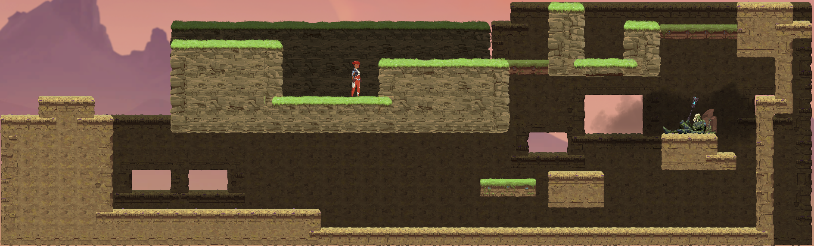
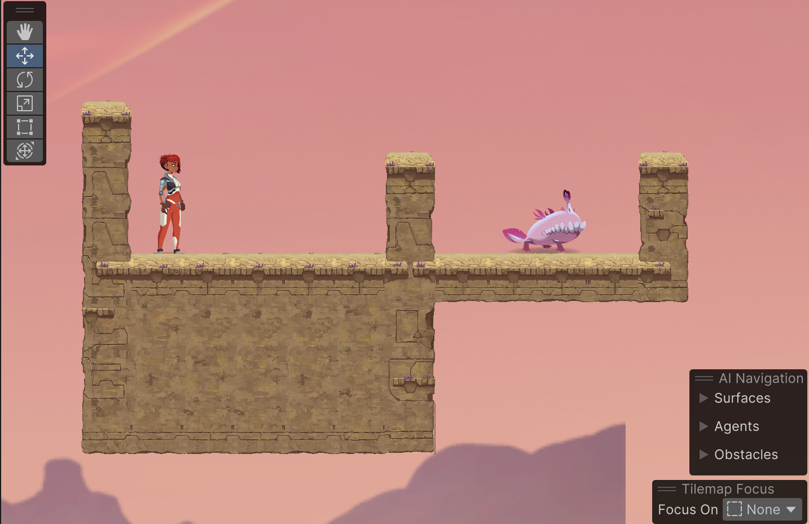
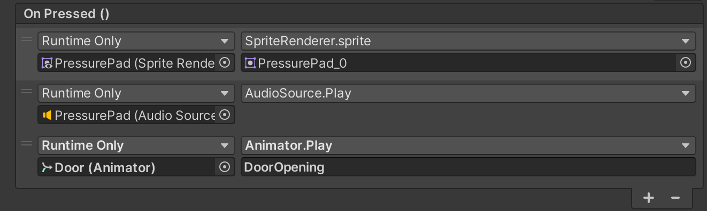
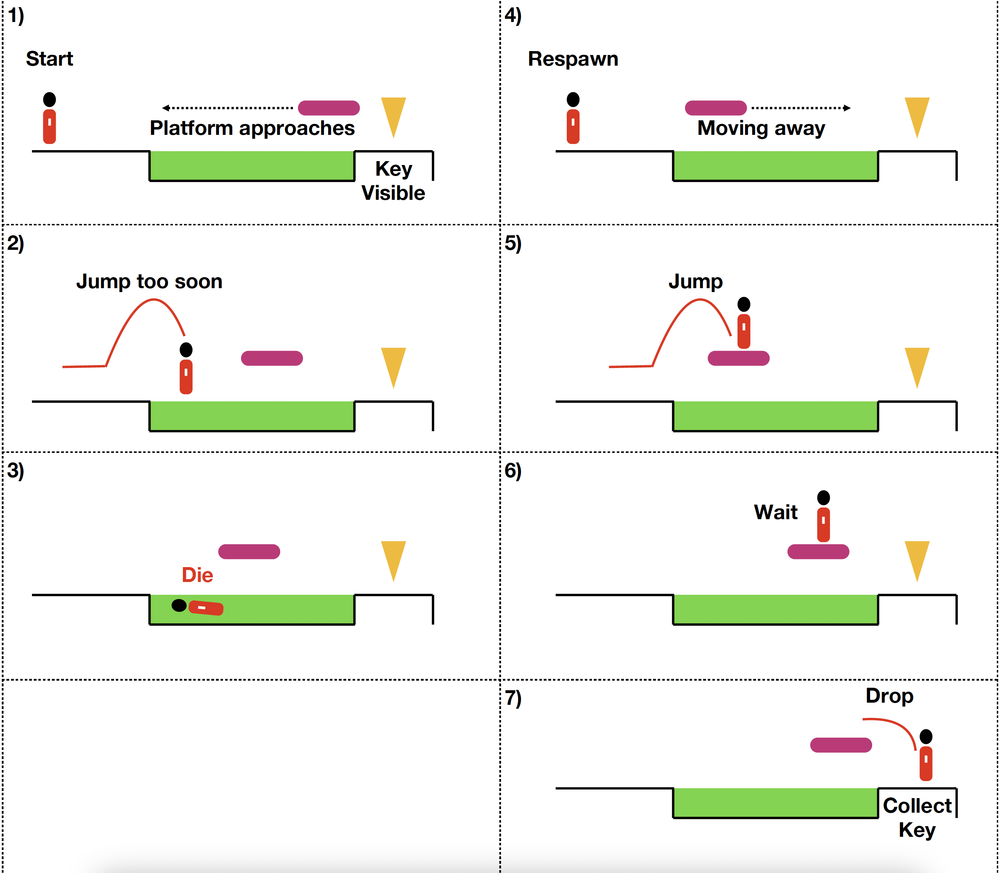

# Week 03 - Toys & Discovery

In today's class, you will begin working on your Level Design Task by exploring the possibility space of the player avatar Ellen and some of the prefabs you'll use in the assignment.

## Tools used
Today's task uses (but is not limited to):

* Github Desktop (or your Github client of choice)
* Unity
* Some sort of storyboarding tool (analog or digital)

## Assignment deliverable
Today, you will be getting familiar with the Level Design Task and by building a small "testing grounds" level and investigating the possibility space of the player character and other objects. You will also create some early storyboards that will inform or be used in your final design documentation.

## Task 1 - Assignment Spec (15 min)
To start today, head over to iLearn and accept the Level Design Task assignment. This will give you your own repo that contains everything you need for Assignment 1. Take some time to read through the README.md file - this is your assignment spec. Note down any questions you have so you can ask in the lectures or on iLearn. Return to this document once you've read through the README.md.

...Welcome back! As you now know, the assignment asks you to create a single level using the provided toolkit. But before you dive into making your level, you need to think a little bit about the type of game you are making. Does the "toy" you are playing with better relate to a precision platformer? Maybe more of a puzzle game, or something action focused? 

Open up the Unity project inside the Level Design Task repo, then open `Assets > Scenes > Testing > Testing Grounds.unity`. You'll be building here today. This is a step towards completing your assignment, so make sure you are pushing to Github regularly.

## Task 2 - Verbs: Move, Jump, Shoot, Swing (10 min)
The scene you've opened up is a Testing Grounds for experimenting with and playing with the Ellen toy. The creation of big testing levels (sometimes called "gyms") is a common design practice that allows game designers to get a feel for the objects in the game - in this case - find what is fun about them.

The first thing we want to play with is the toy of Ellen, our player avatar. A small scene has been set-up for you that gives you space to run around as Ellen and interact with a few objects.

The darker coloured, mossy platforms are "passthrough" platforms. Ellen can fall through them by pressing down and jump at the same time. To move back up, Ellen just has to jump through them.

There are also gun and staff pick-ups in the level.

Spend some time playing around with Ellen in this space. Observe how Ellen moves, how jumping operates, and how weapons feel.

Consider what is fun about this toy. What mechanics are interesting to mess around with? Note:

* What are all the verbs of what Ellen can do?
* What happens when mechanics are combined? What does combining them allow the player to do?
* What are some rules of the game world the player is beholden to? Can they jump forever? Run through walls, etc.?

This info should start to give you a good idea as to what is fun about this toy, and therefore the kind of game to build. However, we haven't seen Ellen interact with too many objects yet...

## Task 3 - Platforming Experiments (15 min)
You've already been introduced to the two main platforming objects in the game: the passthrough platforms and the moving platforms. Have a look in the `Assets > Prefabs > Required` folder and start to build out your own small section of the Testing Grounds level using these prefabs. You can delete parts of what is already there - this is your Testing Grounds now!

To learn more about how to use the moving platforms and passthrough platforms, check out the `Prefab Reference Guide` in the assignment repository. You will be referring back to this document throughout this class, and when working on your assignment. Look to it whenever you need to know how a prefab works.

Make a few different types of moving platforms (naming them appropriately!), and position them in a way that you can spend some time jumping and running between them.

Note down what is fun or interesting about these moving platforms and how they operate. 

Do the same for the passthrough platforms, then try combining the two into a small sequence. Consider some low-level goals/challenges you can give yourself here, e.g. dropping from a passthrough platform onto a fast moving platform, or making a series of tricky jumps between platforms to make it to stable ground.

An example of a small testing sequence with moving platforms:

Consider how modifications and interactions with these objects contribute to different types of player experiences.

Push your scene to Github now so you have a snapshot of your assignment as it currently is.

### Hazards
So far, things are pretty safe for our player. Hazards can allow us to create more interesting encounters and give a sense of urgency and danger for the player.

In `Assets > Prefabs > Required` there is a Spikes prefab and an Acid prefab. Refer back to the Reference Guide for how these work, and then try testing these in isolation: think about the knock back on Ellen, as well as the colliders on both the acid and spikes.

Then, try incorporating some of these hazards into your platforming design. How does play change if there are spikes on the walls? An acid pit moving along a platform? Make some notes and remember to push to github again so you can return to this version of your Testing Grounds later.

## Task 4 - Combat Experiments (15 min)
In addition to the platforming, the game also contains weapons (gun and staff) and enemies (spitters and chompers) for the player to engage with. 

Create a new section of your Testing Ground to start playing around with these enemies. Try building an area that allows you to escape if necessary. For example:

Note down:

* How does the Chomper respond to the player when they get close? Are there any windows for attack?
* How far is the Spitter's range? What can the Spitter's attack go through?
* What weapons work best against the Chomper and the Spitter?
* What happens when you put a bunch of Chompers or Spitters together?

Again, try to create a sequence that is fun to mess around in and gives you a good idea as to the dynamics that emerge when engaging with the combat system's various objects and verbs (the chomper, the spitter, the gun and the staff). Think about the kind of player experience this can lead to.

Push your project to ensure you capture this version of your Testing Grounds.

## Task 5 - Puzzles and other Experiments (20 min)
By now you should have a good idea as to the flow of this prac, and have explored many of the Required Prefabs for the assignment (we'll look at more next week!). 

However, there is another folder: `Assets > Prefabs > Optional` that contain a number of additional prefabs that allow you to create additional kinds of experiences. These include walls that can be smashed with your staff, blocks that can be pushed, as well as activators like pushpads, switches, etc.

These prefabs lend themselves to puzzle gameplay, but can also be used to create additional combat, environmental or platforming experiences. It's up to you to experiment and find what works!

To get familiar with these prefabs, drop a `TriggerDoor` into your level. By default, this door won't do anything: it's waiting for something to trigger it. Between the plaayer and the door, place a `PressurePad`. In the inspector for the Pressure Pad, the `Pressure Pad (Script)` component allows you to trigger different events when the pad is stood on (OnPressed()) and when stepped off (OnRelease()).

Drag-and-drop the TriggerDoor (in your scene) into a new object slot for the OnPressed() condition. From the Function drop-down, select Animator > Play (string), then type "DoorOpening". See below:

Do the same for OnRelease(), changing the entered string from "DoorOpening" to "DoorClosing".

If all goes well, the door should now open when the player steps on the pad, and close when they step off.

### Finding the fun
Using the Prefab Reference Guide and what you've done so far, continue your experimentations and building your testing grounds to include additional prefabs and combinations. As before, try different combinations (what happens when a block falls on a monster? Can it be used to activate doors?), and consider the kind of experience that you want for your player.

## Task 6 - Playing each other's toys (10 min)
Once you're happy with your testing grounds, invite another student to play around in it. Afterwards, ask them what they found fun about it - did they get the same kind of experience out of it as you, or did they find something else? Return the favour by playing theirs.

## Task 7 - Your toy, and early storyboards (Until end)
By now, you should have a good grip on the different elements of the game system, what the player can do, and how they can interact with the world. We will be covering Challenges next week, but for now start to think about how you plan on using the various objects in your final level, and therefore how you are going to introduce them to the player to teach them what to do.

Rather than building something out the gate, start drafting your storyboards. Storyboards can be made with pen-and-paper, or using online tools such as [diagrams.net](https://app.diagrams.net) or [virtualgraphpaper.com](https://virtual-graph-paper.com/). Storyboards are a part of the assignment submission, and a good way to start to think about how you faciliate discovery in your game. 

For example: how will you teach the player about passthrough platforms? What situation will you put them in where they need to discover they can move up through them, or down through them? 

Storyboards don't need to be beautiful, they just need to be communicative. Here is an example for teaching the player about moving platforms and acid pits:

If you complete a storyboard, try building it in your testing grounds. Does it play out how you expected? What changes did you need to make, if any?

We will be returning to storyboarding and challenges in the next few weeks, so don't stress about this too much. However, make sure you include your storyboards in your assignment repository - you can always redo them later!

Make sure you've pushed everything to Github before logging off!

### Reflect
Consider what you've learnt about the game you are making a level for today. The key takeaway is an understanding of the kind of experiences possible, and the kinds you want to harness in your level. It's okay if you don't have a complete picture of this yet, but you should be starting to formulate an idea.

## Next Week
Next week we will look at moving away from "play" and into "game" by creating goals and challenges for our player. See you then!